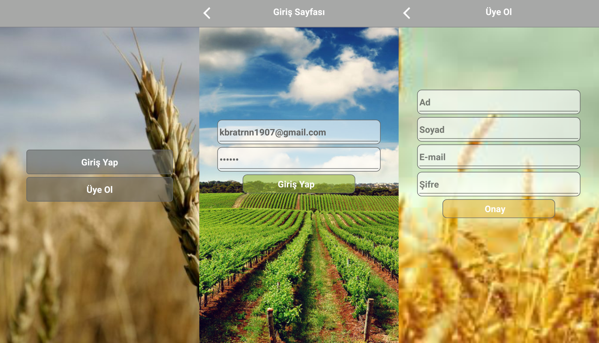
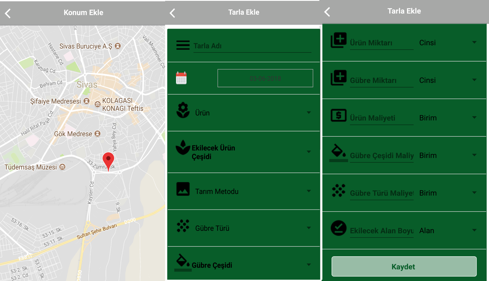
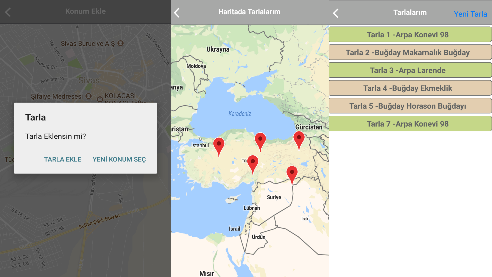
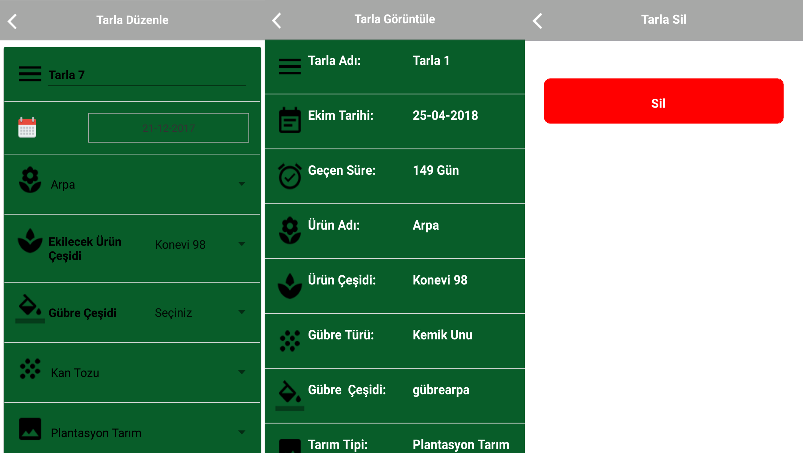

# TUYS (TARIMSAL ÜRETİM YÖNETİM SİSTEMİ
*Tarlası olan kullanıcıların haritada tarlalarını görebildiği ve tarlaları ile ilgili bilgilerin bulunduğu react-native ile yazılmış mobil proje.*

# Uygulama Görselleri
* 

* 

* 

* 

* 

